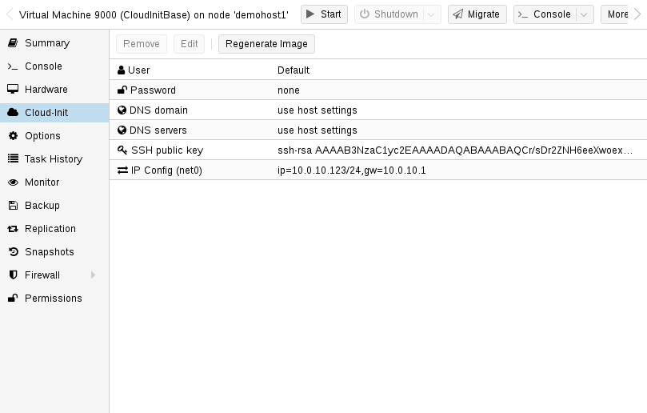

# JJP's Notes
## What is changed from the original and some lessons learned:

I pined the telmate provider to 2.9.13 Mostly did this to keep this stable in my own env.

In the main.tf I added the scsihw line as it seems to be a better fit for the scsi disk we're using.

Also in the main.tf I adjusted the join functions under data.template_file.k8s to be more with current Terraform practices. 

In the end you'll have Kubernetes cluster at v1.22.2
This can be changed at `inventory/my-cluster/group_vars/all.yml`

For a selection of versions go here:

https://github.com/k3s-io/k3s/releases

## Lessons learned:
The step regarding the display being set to serial0 is a *personal choice*.

The template's hardware setting **can be overwritten** by the Terraform during the clone. 

This means even though I had modified the templates disk controller to be scsi... when cloned to the new nodes it would create them with the default LSI.
This drove the change in the Terraform.

### TL;DR - Make sure the template is created or converted to qcow2.

* I missed a step converting the cloud-init img and imported it as raw instead of what it should've been (qcow2).

  * The impact of this and behavior was a little hard to see at first.
The Terraform would not succeed and gave the indication that starting of the VMs was happening outside of Terraform's execution.

  * Another side effect was the Ansible inventory not being built from the Terraform even though from the Proxmox UI VMs were created.

  * The Terraform statefiles showed entries for the nodes created but did not have the field "**default_ipv4_address**" which the Ansible inventory from.  

* When you download the kube config file you'll need to edit it to change the IP 127.0.0.1 to the IP of your Main/Master node.

## Credits
This repo was cloned from:

https://github.com/NatiSayada/k3s-proxmox-terraform-ansible.git

Which I found through this Medium article:

https://medium.com/@ssnetanel/build-a-kubernetes-cluster-using-k3s-on-proxmox-via-ansible-and-terraform-c97c7974d4a5

## Future work
I'm going to try to merge the functions of these two as the combined powers would make it a really good Proxmox provider.

I'll do this in my free time. :joy_cat:

This repo uses the Terraform provider from Telmate

https://github.com/Telmate/terraform-provider-proxmox.git

In troubleshooting this I also found this Terraform provider

https://github.com/bpg/terraform-provider-proxmox.git

# - End JJP's Notes -
# Build a Kubernetes cluster using k3s on Proxmox via Ansible and Terraform

This is based on the great work that <https://github.com/itwars> done with Ansible, all I left to do is to put it all together with terraform and Proxmox!

## System requirements

* The deployment environment must have Ansible 2.4.0+
* Terraform installed
* Proxmox server
* kubectl  _Added by JJP_

## How to
for updated documentation check out my [medium](https://medium.com/@ssnetanel/build-a-kubernetes-cluster-using-k3s-on-proxmox-via-ansible-and-terraform-c97c7974d4a5).

### Proxmox setup

This setup is relaying on cloud-init images.

Using cloud-init image save us a lot of time and it's work great!
I use ubuntu focal image, you can use whatever distro you like.

to configure the cloud-init image you will need to connect to a Linux server and run the following:

install image tools on the server (you will need another server, these tools cannot be installed on Proxmox)

```bash
apt-get install libguestfs-tools
```

Get the image that you would like to work with.
you can browse to <https://cloud-images.ubuntu.com> and select any other version that you would like to work with.
for Debian, got to <https://cloud.debian.org/images/cloud/>.
it can also work for centos (R.I.P)

```bash
wget https://cloud-images.ubuntu.com/focal/current/focal-server-cloudimg-amd64.img
```

update the image and install Proxmox agent - this is a must if we want terraform to work properly.
it can take a minute to add the package to the image.

```bash
virt-customize focal-server-cloudimg-amd64.img --install qemu-guest-agent
```

now that we have the image, we need to move it to the Proxmox server.
we can do that by using `scp`

```bash
scp focal-server-cloudimg-amd64.img Proxmox_username@Proxmox_host:/path_on_Proxmox/focal-server-cloudimg-amd64.img
```

so now we should have the image configured and on our Proxmox server. let's start creating the VM

```bash
qm create 9000 --name "ubuntu-focal-cloudinit-template" --memory 2048 --net0 virtio,bridge=vmbr0
```

for ubuntu images, rename the image suffix

```bash
mv focal-server-cloudimg-amd64.img focal-server-cloudimg-amd64.qcow2
```

import the disk to the VM

```bash
qm importdisk 9000 focal-server-cloudimg-amd64.qcow2 local-lvm
```

configure the VM to use the new image

```bash
qm set 9000 --scsihw virtio-scsi-pci --scsi0 local-lvm:vm-9000-disk-0
```

add cloud-init image to the VM

```bash
qm set 9000 --ide2 local-lvm:cloudinit
```

set the VM to boot from the cloud-init disk:

```bash
qm set 9000 --boot c --bootdisk scsi0
```

update the serial on the VM

```bash
qm set 9000 --serial0 socket --vga serial0
```

Good! so we are almost done with the image. now we can configure our base configuration for the image.
you can connect to the Proxmox server and go to your VM and look on the cloud-init tab, here you will find some more parameters that we will need to change.



you will need to change the user name, password, and add the ssh public key so we can connect to the VM later using Ansible and terraform.
update the variables and click on `Regenerate Image`

Great! so now we can convert the VM to a template and start working with terraform.

```bash
qm template 9000
```

### terraform setup

our terraform file also creates a dynamic host file for Ansible, so we need to create the files first

```bash
cp -R inventory/sample inventory/my-cluster
```

Rename the file `terraform/terraform.tfvars.sample` to `terraform.tfvars` and update all the vars.

There you can select how many nodes would you like to have on your cluster and configure the name of the base image. 

It's also important to update the ssh key that is going to be used and proxmox host address.
to run the Terrafom, you will need to cd into `terraform` and run:

```bash
cd terraform/
terraform init
terraform plan 
terraform apply
```

it can take some time to create the servers on Proxmox but you can monitor them over Proxmox.
it should look like this now:


### Ansible setup

First, update the var file in `inventory/my-cluster/group_vars/all.yml` and update the ```ansible_user``` that you're selected in the cloud-init setup. 

You can also choose if you would like to install metallb and argocd. if you are installing metallb, you should also specified an ip range for metallb. 

If you are running multiple clusters in your kubeconfig file, make sure to disable ```copy_kubeconfig```.

After you run Terraform, your `inventory/my-cluster/hosts.ini` file should look like this:

```bash
[master]
192.168.3.200 Ansible_ssh_private_key_file=~/.ssh/proxk3s

[node]
192.168.3.202 Ansible_ssh_private_key_file=~/.ssh/proxk3s
192.168.3.201 Ansible_ssh_private_key_file=~/.ssh/proxk3s
192.168.3.198 Ansible_ssh_private_key_file=~/.ssh/proxk3s
192.168.3.203 Ansible_ssh_private_key_file=~/.ssh/proxk3s

[k3s_cluster:children]
master
node
```

Start provisioning of the cluster using the following command:

```bash
# cd to the project root folder
cd ..

# run the playbook
ansible-playbook -i inventory/my-cluster/hosts.ini site.yml
```

It can a few minutes, but once its done, you should have a k3s cluster up and running.

### Kubeconfig

The ansible should already copy the file to your ~/.kube/config (if you enable the ```copy_kubeconfig``` in  ```inventory/my-cluster/group_vars/all.yml```), but if you are having issues you can scp and check the status again.

```bash
scp debian@master_ip:~/.kube/config ~/.kube/config
```

### Argocd
To get argocd initial password run the following:

```
kubectl -n argocd get secret argocd-initial-admin-secret -o jsonpath="{.data.password}" | base64 -d; echo
```

## Enjoy!

Kubernets is realy fun to learn and there is so muche things that you can automate.

Have fun :)
